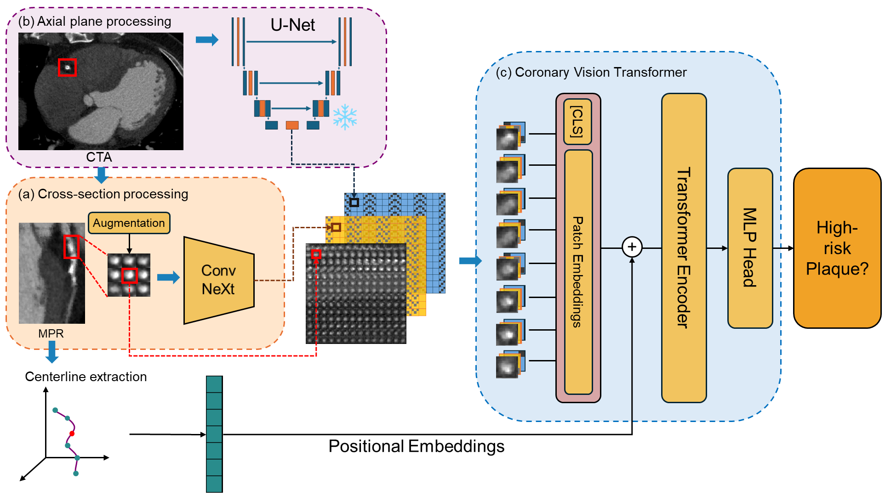

# ViTAL-CT: Vision Transformers for High-Risk Plaque Detection in Coronary CTA

[](https://github.com/JZCambridge/ViTAL-CT-MICCAI25)
[](LICENSE)
[](https://www.python.org/downloads/)
[](https://pytorch.org/)

<p align="center">
  
</p>

## 🔥 Highlights

- **First segmentation-free ViT framework** for high-risk plaque (HRP) classification in coronary CTA
- **Hybrid multi-scale architecture** combining Vision Transformers, ConvNeXt blocks, and U-Net features
- **State-of-the-art performance** with 0.818 AUC on 3,068 coronary arteries
- **Clinical applicability** - eliminates need for manual plaque segmentation

## 📋 Table of Contents

- [Overview](#overview)
- [Installation](#installation)
- [Dataset Preparation](#dataset-preparation)
- [Model Architecture](#model-architecture)
- [Training](#training)
- [Evaluation](#evaluation)
- [Results](#results)
- [Citation](#citation)
- [License](#license)

## 🎯 Overview

High-risk plaque (HRP) detected by coronary CT angiography is associated with increased risks of major adverse cardiovascular events. Current identification of HRP characteristics involves labor-intensive segmentation of plaques, requiring substantial time and expert knowledge.

**ViTAL-CT** proposes a novel coronary cross-sectional Vision Transformer framework that bypasses the need for explicit segmentation by directly predicting the presence of HRP from cross-sectional slices along the coronary centerline.

### Key Features

- **Segmentation-free approach**: Direct HRP classification without manual annotations
- **Multi-scale representation**: Combines proximal/distal cross-sections with axial context
- **Hybrid architecture**: Integrates ViT, ConvNeXt, and U-Net components
- **Clinical efficiency**: Optimizes decision-making in coronary artery disease care

## 🛠 Installation

### Requirements

- Python 3.8+
- PyTorch 1.9+
- CUDA 11.0+ (for GPU training)

### Setup Environment

```bash
# Clone the repository
git clone https://github.com/JZCambridge/ViTAL-CT-MICCAI25.git
cd ViTAL-CT-MICCAI25

# Create conda environment
conda create -n vital-ct python=3.8
conda activate vital-ct

# Install PyTorch (adjust CUDA version as needed)
conda install pytorch torchvision torchaudio pytorch-cuda=11.8 -c pytorch -c nvidia

# Install other dependencies
pip install -r requirements.txt
```

### Dependencies

```bash
# Core dependencies
torch>=1.9.0
torchvision>=0.10.0
timm>=0.6.0
einops>=0.4.0
nibabel>=3.2.0
pandas>=1.3.0
numpy>=1.21.0
scikit-learn>=1.0.0
matplotlib>=3.4.0
tqdm>=4.62.0
```

## 📊 Dataset Preparation

### Data Structure

Organize your coronary CTA data as follows:

```
data/
├── train/
│   ├── patient_001_RCA.pt
│   ├── patient_001_LAD.pt
│   └── ...
├── val/
│   ├── patient_100_RCA.pt
│   └── ...
├── test/
│   ├── patient_200_LAD.pt
│   └── ...
├── positions/
│   ├── patient_001_RCA_pos.pt
│   └── ...
├── unet/
│   ├── patient_001_RCA_grid_features.pt
│   └── ...
└── annotations.csv
```

### Annotation Format

The annotation CSV should contain:

| file | HRP2 |
|------|------|
| patient_001_RCA.nii.gz | [0, 1] |

### Data Preprocessing

For NIfTI files, use the provided data loaders:

```python
from utils.dataloader import Dataloader_CTA

train_loader, val_loader, test_loader, weights = Dataloader_CTA(
    cfg=config,
    filepath="path/to/data",
    table_path="path/to/annotations.csv",
    label="HRP2",
    input_data_type="tensor_combined"
)
```

## 🏗 Model Architecture

ViTAL-CT integrates three complementary streams:

### 1. Cross-Section Stream
- Grayscale 2D cross-sections centered on coronary artery
- Provides localized plaque information

### 2. Multi-Slice Context Stream
- Coronary-tailored ConvNeXt block processing 9 adjacent slices
- Captures longitudinal plaque morphology with anisotropic kernels

### 3. Global Context Stream
- U-Net bottleneck encoding overall axial plane context
- Provides comprehensive spatial information


## 🚀 Training

### Basic Training

```bash
python main.py \
    -event_name "vital_ct_experiment" \
    -vit_size "base" \
    -bs 32 \
    -data_path "/path/to/data" \
    -annotation "/path/to/annotations.csv" \
    -epochs 60 \
    -train_type "resvit" \
    -loss_func "bce" \
    -num_classes 1
```

### Advanced Configuration

```bash
python main.py \
    -event_name "vital_ct_advanced" \
    -vit_size "base" \
    -bs 32 \
    -data_path "/path/to/ScotHeart_Aug_ResVit" \
    -annotation "/path/to/Toshiba_HRP.csv" \
    -lr 1e-4 \
    -epochs 60 \
    -train_type "resvit" \
    -loss_func "focal" \
    -rank 64 \
    -alpha 64 \
    -split "stratified" \
    -balance True
```


## 📈 Evaluation

### Model Performance

The trained model achieves the following performance on the test set:

| Method | AUC | Precision | Recall | F1 |
|--------|-----|-----------|---------|-----|
| ViT Tiny | 0.755 | 0.678 | 0.710 | 0.690 |
| ViT Base + LoRA | 0.799 | 0.685 | 0.735 | 0.698 |
| ResNet50 2D | 0.806 | 0.721 | 0.697 | 0.707 |
| **ViTAL-CT (Ours)** | **0.818** | **0.735** | **0.771** | **0.749** |

### Ablation Studies

| Component | AUC | Impact |
|-----------|-----|---------|
| Without U-Net | 0.758 | -6% |
| Without ConvNeXt | 0.685 | -13% |
| Without Pos Embed | 0.775 | -4% |
| Without Augmentation | 0.737 | -10% |
| **Full ViTAL-CT** | **0.818** | **-** |

## 🔍 Key Innovations

### 1. Segmentation-Free Framework
- Eliminates need for manual plaque/vessel wall segmentation
- Direct end-to-end learning from cross-sectional images

### 2. Multi-Scale Feature Fusion
- **Local features**: Cross-sectional patches (16×16)
- **Contextual features**: Adjacent slices via ConvNeXt
- **Global features**: U-Net encoded axial context

### 4. Coronary-Specific Design
- Anisotropic ConvNeXt kernels (7×3) for vessel structure
- Vessel-aware attention for calcified vs. low-attenuation regions
- Patch size optimized for coronary diameter (~3-4.5mm)

## 🎯 Clinical Impact

- **Reduced analysis time**: Eliminates manual segmentation bottleneck
- **Improved scalability**: Automated HRP detection for large cohorts
- **Enhanced reproducibility**: Consistent results across different operators
- **Clinical decision support**: Risk stratification for MACE prediction

## 📝 Citation

If you use this code or find our work helpful, please cite our paper:

```bibtex
@inproceedings{le2025vital,
  title={ViTAL-CT: Vision Transformers for High-Risk Plaque Detection in Coronary CTA},
  author={Le, Anjie and Zheng, Jin and Gong, Tan and Sun, Quanlin and Weir-McCall, Jonathan and O'Regan, Declan and Williams, Michelle and Newby, David and Rudd, James and Huang, Yuan},
  booktitle={International Conference on Medical Image Computing and Computer-Assisted Intervention},
  year={2025},
  organization={Springer}
}
```


## 📧 Contact

- **Yuan Huang**: [yh288@cam.ac.uk](mailto:yh288@cam.ac.uk)

## 📄 License

This project is licensed under the MIT License - see the [LICENSE](LICENSE) file for details.

## 🙏 Acknowledgments

- SCOT-HEART study investigators for providing the dataset
- Cambridge University and collaborating institutions
- Medical Research Council and British Heart Foundation for funding

---

**Note**: This research is for academic purposes only. The model has not been validated for clinical use and should not be used for medical diagnosis without proper validation and regulatory approval.